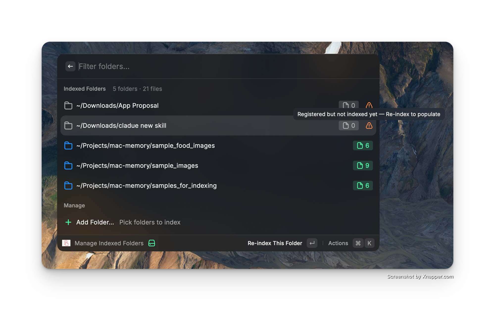
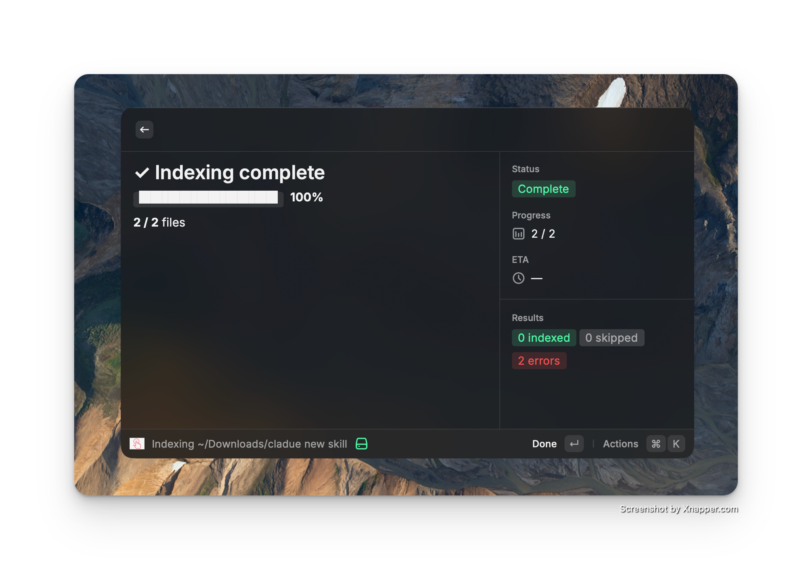
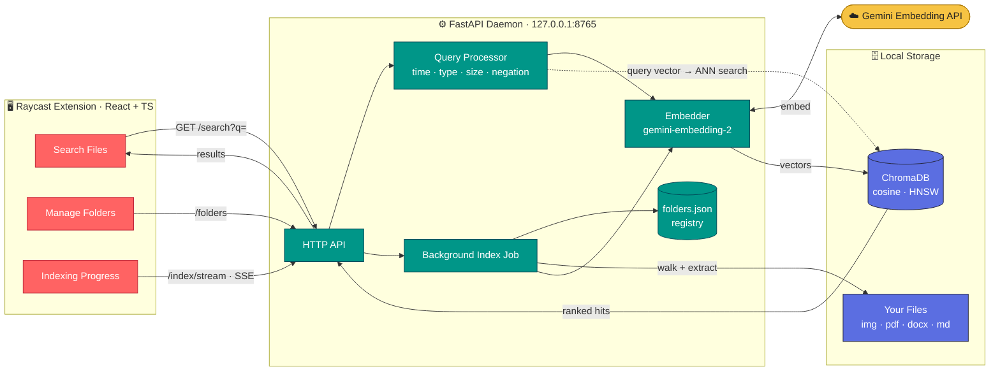
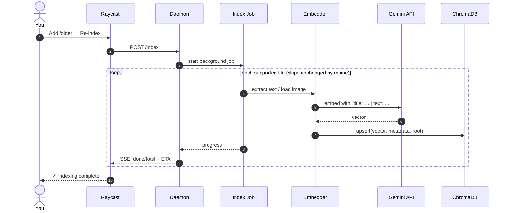
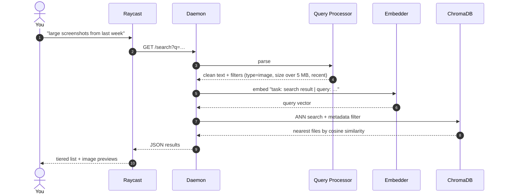

<div align="center">

# 🕵️ Mac Memory

### Search your Mac the way you remember it — by meaning, not by filename.

You don't remember that a file was called `IMG_4471.png` or `final_v3_REAL.pdf`.
You remember *"the whiteboard photo from the architecture meeting"* or *"the lease I signed in March."*
Mac Memory lets you search for exactly that.

It reads your files — images, PDFs, notes, Word docs, slide decks — turns their **meaning** into vectors with Google's `gemini-embedding-2` model, and serves instant semantic search straight from a [Raycast](https://raycast.com) command. Everything runs locally on your machine.

[](https://www.python.org)
[](https://fastapi.tiangolo.com)
[](https://www.trychroma.com)
[](https://raycast.com)
[](#-license)

</div>

---

<!-- ───────────────────────────────────────────────────────────────────── -->
<!-- 📹 DEMO VIDEO — replace this block with your walkthrough.               -->
<!-- On GitHub you can drag-and-drop an .mp4/.mov directly into the README   -->
<!-- editor and it becomes a playable embed. Or link a thumbnail to YouTube: -->
<!--   [](https://youtu.be/VIDEO_ID) -->
<!-- ───────────────────────────────────────────────────────────────────── -->

> ### 🎬 Demo
>
> **▶ Video walkthrough coming soon — drop your `.mp4` here.**
>
> _(Placeholder: a 60-second clip showing a query like “the chart from the Q3 deck” surfacing the right slide instantly.)_

---

## Why this exists

Spotlight matches **filenames and exact keywords**. It can't find a photo of a sunset unless "sunset" is in the name, and it can't find the PDF where you discussed pricing unless you remember a literal phrase from it.

Mac Memory works differently. It builds a **semantic index** of your files' actual content, so a query and a file match when they *mean* the same thing — even with zero shared words.

Try queries like:

| You type… | It finds… |
|-----------|-----------|
| `the whiteboard photo from standup` | a `.png` screenshot of a whiteboard — no "whiteboard" in the filename |
| `my apartment lease` | the scanned rental contract PDF |
| `that error with the null pointer` | the screenshot of the stack trace |
| `Q3 revenue slides` | the right `.pptx`, matched on its slide text |
| `pasta recipe I saved` | the note, even if it's titled `Untitled 7.md` |
| `passport scan` | the document, matched on its OCR'd text |

### Mac Memory vs. Spotlight

<!-- Add a search-results screenshot here showing a query matching a file with no shared words. -->


> _Example: typing **"a photo of a cat"** surfaces `cat.jpeg` at the top — ranked by meaning, not filename._

| | 🔦 Spotlight | 🕵️ Mac Memory |
|---|---|---|
| **Matches on** | filename + exact keywords | the **meaning** of the content |
| **"sunset photo" finds** | files literally named *sunset* | any beach/sky photo, by what it depicts |
| **Inside a PDF / deck** | only if you recall an exact phrase | concepts and paraphrases |
| **Text inside an image** | ✗ | ✓ via OCR |
| **Natural-language filters** | ✗ | "large PDFs from last week" |
| **Runs as** | system service | local daemon + Raycast UI |
| **Data leaves device** | no | only short embed payloads |

---

## ✨ Features

- **Semantic search across file types** — images, PDFs, text/code, Word & PowerPoint, all in one index.
- **Multimodal understanding** — photos are matched on their *visual content*; documents on their *text*; scanned images on their *OCR'd* text.
- **Fully local** — your files never leave your Mac. Only short text/image payloads go to the embedding API; the index lives on disk.
- **Native Raycast UI** — search, pick folders, and watch live indexing progress without touching a terminal.
- **Smart query parsing** — "large screenshots from last week" automatically applies a type, size, and time filter.
- **Incremental & idempotent** — re-indexing only touches files that actually changed (modification-time aware).
- **Background daemon** — a local service keeps the index warm, so searches return with no cold-start.

---

## 📸 Screenshots

| Manage Indexed Folders | Live Indexing Progress |
|:---:|:---:|
|  |  |
| Add folders, see per-folder counts, re-index on demand | A live ETA bar, current file, and a result summary |

**Search Files**

<!-- Capture a clean Search command screenshot and save it here. -->


> _Results are grouped by relevance tier with a similarity meter and an image-preview detail panel._

---

## 🧠 How it works

Mac Memory is three layers: a **Raycast front end**, a **local daemon**, and an **embedding pipeline** backed by a vector store.



### The two flows

**Indexing (write path)** — turn files into searchable vectors:



**Search (read path)** — turn a phrase into ranked files:



### 1. Embeddings & vector search

Every file is converted into a high-dimensional **embedding** — a vector that captures meaning. Files with similar meaning land close together in vector space. A search query is embedded the same way, and Mac Memory returns the files whose vectors are nearest (by **cosine similarity**), using ChromaDB's HNSW index for fast approximate nearest-neighbor lookup.

- **Images** are embedded *visually* by the multimodal model — a beach photo and the query "ocean at sunset" land near each other with no text in common.
- **PDFs / Word / PowerPoint** are parsed to plain text (PyMuPDF, `python-docx`, `python-pptx`), then embedded as documents.
- **Text & code** files are embedded directly.

ChromaDB returns a **distance**; Mac Memory converts it to an intuitive `similarity` score and ranks by it:

```python
# search.py — distance → similarity, best (lowest distance) first
results = collection.query(query_embeddings=[vector], n_results=top_k,
                           where=where, include=["metadatas", "distances"])
SearchResult(
    name=meta["name"],
    file_type=meta["type"],
    similarity=round(1.0 - distance, 4),   # cosine distance → 0..1 score
    size=meta.get("size", 0),
)
```

A single result comes back to the UI as plain JSON:

```json
{ "path": "/Users/you/Desktop/beach.jpg", "name": "beach.jpg",
  "file_type": "image", "similarity": 0.78, "size": 1048576 }
```

### 2. The cross-modal trick (`gemini-embedding-2` task prefixes)

This is the detail that makes search actually good. `gemini-embedding-2` is multimodal, but it does **not** take a `task_type` parameter — instead the retrieval task must be encoded as a **text prefix** on the content. The whole trick is two tiny helpers:

```python
# embedder.py
def _doc_prefix(title: str, content: str) -> str:
    return f"title: {title} | text: {content}"

def _query_prefix(query: str) -> str:
    return f"task: search result | query: {query}"

def embed_query(query: str):                       # search side
    return embed_text(_query_prefix(query))
```

So the same words get embedded differently depending on their role:

```text
query  →  "task: search result | query: ocean at sunset"
doc    →  "title: beach.jpg | text: a wide sandy shoreline..."
```

Images carry the document instruction too — the picture is sent *alongside* a doc prefix:

```python
# embedder.py — embed an image as a "document"
contents = [_doc_prefix("photo", ""), part]        # part = the image bytes
client.models.embed_content(model="gemini-embedding-2", contents=contents)
```

Without the prefixes the model returns generic embeddings and cross-modal matching collapses. *With* them, the query and the image project into a shared retrieval space. Measured on the same files, query **"a photo of a cat"** vs. the cat image:

| Setup | cosine similarity | result |
|-------|:-----------------:|--------|
| no prefix (query vs raw image) | **0.39** | ties with unrelated PDFs — ranking is luck |
| query prefix only | **0.66** | cat clearly ahead |
| query + image doc prefix | **0.76** | cat wins decisively, distractors ~0.57 |

That single change took the benchmark from **36% → strong** precision@1 on image queries.

### 3. The local daemon (FastAPI)

A small FastAPI service binds to `127.0.0.1:8765` (loopback only — nothing on your network can reach it) and wraps the Python pipeline:

| Endpoint | Purpose |
|----------|---------|
| `GET /health` | liveness check |
| `GET /search?q=&top_k=&type=` | semantic search, optional type filter |
| `GET/POST/DELETE /folders` | the folder registry + per-folder file counts |
| `POST /index` | start a background indexing job |
| `GET /index/stream` | **Server-Sent Events** stream of live progress |
| `GET /index/status` | current job snapshot |

Because the daemon holds the ChromaDB collection open, searches have **no per-query cold start**, and indexing runs in a background thread that streams progress to the UI. You can hit it directly:

```bash
curl -s 'localhost:8765/search?q=a%20photo%20of%20a%20cat&top_k=2' | python3 -m json.tool
```
```json
[
  { "name": "cat.jpeg",  "file_type": "image", "similarity": 0.76, "path": "…/cat.jpeg" },
  { "name": "sphynx.jpeg","file_type": "image", "similarity": 0.71, "path": "…/sphynx.jpeg" }
]
```

The progress stream is line-delimited SSE — each event is one JSON snapshot:

```text
data: {"status":"running","total":142,"done":83,"current":"invoice.pdf","eta_seconds":88.0}
data: {"status":"done","indexed":120,"skipped":18,"errors":4}
```

### 4. Query intelligence

Before a query is embedded, a parser extracts structured filters and strips them from the text, so the semantic part stays clean:

- **Temporal** — "last week", "yesterday", "in March", "2025-12-01" → a modification-time range
- **Type** — "photos", "PDFs", "notes" → a type filter
- **Size** — "large files", "under 5mb" → a size filter
- **Negation** — "documents not pdf" → an exclusion
- **Expansion** — "meeting" also searches "conversation / discussion / call", widening recall

Real output from `process_query()` — the filters become a ChromaDB `where` clause, and only the meaning is left to embed:

```python
>>> process_query("pdf invoices under 5mb")
{ "clean_query": "invoices",
  "where_filter": {"type": "pdf", "size": {"$lt": 5242880}} }

>>> process_query("screenshots from last week")
{ "clean_query": "from",
  "where_filter": {"mtime": {"$gte": 1778855295.49}, "type": "image"} }

>>> process_query("documents not pdf")
{ "clean_query": "",
  "where_filter": {"type": {"$nin": ["pdf"]}} }
```

When the query is *all* filters (like the last one), there's nothing to embed — the search falls back to a pure metadata filter.

### 5. Enrichment

Images get extra context at index time: **OCR** (Tesseract) pulls any text inside the image, and **EXIF** metadata captures timestamps and GPS — so a screenshot full of text is findable by what it *says*, not just how it looks. Each file is stored in ChromaDB with metadata like:

```python
{
  "path": "/Users/you/Desktop/receipt.png",
  "name": "receipt.png",
  "type": "image",
  "size": 184320,
  "mtime": 1778855295.49,
  "root": "/Users/you/Desktop",          # which indexed folder it came from
  "ocr_text": "WHOLE FOODS  TOTAL $42.18  VISA ****1234",
  "exif_timestamp": "2025:11:02 14:31:08"
}
```

The `root` field is what powers the per-folder file counts in **Manage Indexed Folders**, and the `mtime` is what lets re-indexing skip unchanged files.

---

## 📂 Supported file types

| Category | Extensions | How it's indexed |
|----------|-----------|------------------|
| **Images** | `jpg` `jpeg` `png` `gif` `webp` `heic` `heif` | Visual embedding + OCR text + EXIF |
| **PDF** | `pdf` | Extracted text (first pages) |
| **Text / code** | `txt` `md` `py` `js` `ts` `json` `csv` `html` | Raw text |
| **Office** | `docx` `pptx` | Extracted text |
| **Audio** | `mp3` `wav` `m4a` `ogg` | 🚧 Planned (Whisper transcription) |

---

## 🚀 Getting started

### Prerequisites

- **macOS** (the daemon uses `launchd`; Raycast is Mac-only)
- **Python 3.12+** and **[uv](https://docs.astral.sh/uv/)**
- **[Tesseract](https://github.com/tesseract-ocr/tesseract)** for image OCR — `brew install tesseract`
- A **[Gemini API key](https://aistudio.google.com/apikey)** (free tier works)
- The **[Raycast](https://raycast.com)** app + Node.js (for the extension)

### 1. Clone & install

```bash
git clone https://github.com/vNihar007/mac-memory.git
cd mac-memory
uv sync
brew install tesseract
```

### 2. Add your API key

```bash
echo "GEMINI_API_KEY=your_key_here" > .env
```

### 3. Start the daemon

The one-time installer wires up a `launchd` agent so the daemon starts on login and restarts if it crashes:

```bash
./setup.sh
```

Or, while developing (auto-reloads on code changes):

```bash
cd src && MACMEM_DEV=1 uv run python -m mac_memory.server
```

Verify it's up:

```bash
curl -s localhost:8765/health    # → {"status":"ok"}
```

### 4. Load the Raycast extension

```bash
cd raycast
npm install
ray develop
```

The **Search Files** and **Manage Indexed Folders** commands now appear in Raycast.

---

## 📖 Usage

### Index your folders

1. Open **Manage Indexed Folders** in Raycast.
2. Hit **Add Folder…** and pick any directories (e.g. `~/Documents`, `~/Desktop/screenshots`).
3. Select a folder → **Re-index This Folder**. A live progress view shows the ETA and current file.

> Indexing calls the embedding API once per file with a small rate-limit pause, so the first run of a large folder takes a few minutes. After that, re-indexing only re-processes files that changed.

### Search

Open **Search Files** and type naturally:

- `architecture diagram` → the right image, even if it's named `Screenshot 2025-11-02.png`
- `invoice from the landlord` → the scanned PDF
- `large screenshots from last week` → applies type + size + time filters automatically

Results are grouped by relevance tier (strong / possible / weak), with a similarity meter and a detail panel that previews images and shows metadata. Use the type dropdown to filter to Images, PDFs, Text, or Office files.

---

## 💸 Cost & limits

Mac Memory runs on Google's **Gemini embedding API**, which has a generous **free tier** — personal indexing usually stays well within it.

- **Pacing.** Indexing sleeps **~1.5 s between files** to stay under free-tier rate limits, so the first pass of a big folder takes a while:

  | Files | Approx. first-time index |
  |------:|:--|
  | 100 | ~2.5 min |
  | 500 | ~13 min |
  | 1,000 | ~25 min |

- **Pay once.** Re-indexing only re-embeds files whose modification time changed — a re-index of an unchanged folder finishes in seconds.
- **Minimal payload.** Only extracted text and (for images) the image bytes are sent to the API. Your folders, file tree, and the vector index never leave the machine.
- **Tunable.** On a paid tier, drop the `time.sleep(1.5)` in `jobs.py` to index much faster.

---

## 🗂 Project structure

```
mac-memory/
├── src/mac_memory/
│   ├── configure.py        # paths, supported extensions, daemon config
│   ├── embedder.py         # gemini-embedding-2 wrappers (text/image/pdf/office)
│   ├── enricher.py         # OCR + EXIF extraction for images
│   ├── indexer.py          # walk folders, embed, upsert into ChromaDB
│   ├── query_processor.py  # temporal/type/size/negation parsing + expansion
│   ├── search.py           # query → embed → ChromaDB → ranked results
│   ├── registry.py         # persistent folder list (~/.mac-memory/folders.json)
│   ├── jobs.py             # background indexing job + progress state
│   └── server.py           # FastAPI daemon (search / folders / index / SSE)
├── raycast/
│   └── src/
│       ├── api.ts          # typed HTTP client + self-healing daemon check
│       ├── search.tsx      # Search Files command
│       ├── manage-folders.tsx  # folder management UI
│       └── progress-view.tsx   # live indexing progress + ETA
├── setup.sh                # one-time launchd installer
└── pyproject.toml
```

---

## ⚙️ Configuration

Everything lives in `src/mac_memory/configure.py`:

- `SUPPORTED_EXTENSIONS` — which file types get indexed
- `CHROMA_PATH` — where the vector DB is stored
- `HOST` / `PORT` — daemon bind address (default `127.0.0.1:8765`)
- `SKIP_DIRS` — directories to ignore (`.git`, `node_modules`, `__pycache__`)

The folder registry is stored at `~/.mac-memory/folders.json`; daemon logs go to `~/.mac-memory/daemon.log`.

---

## 🛣 Roadmap

- 🎙 **Audio** — transcribe `mp3`/`m4a` with Whisper, then embed the transcript
- 🔁 **Auto-indexing** — file-system watcher so new files index without a manual trigger
- 🧩 **More formats** — `xlsx`, `.pages`, `.key`, plain `.doc`
- 💬 **Answer mode** — synthesize an answer from matched files, not just a file list
- 📦 **One-click install** — package the daemon so no local Python setup is needed

---

## 🧰 Tech stack

| Layer | Tools |
|-------|-------|
| Embeddings | Google `gemini-embedding-2` (multimodal) |
| Vector store | ChromaDB (cosine, HNSW) |
| Extraction | PyMuPDF · `python-docx` · `python-pptx` · Tesseract (OCR) · `exifread` |
| Daemon | FastAPI · Uvicorn · `sse-starlette` |
| Front end | Raycast (`@raycast/api`, React + TypeScript) |
| Tooling | `uv` · `launchd` |

---

## 📄 License

[MIT](LICENSE) © Varun Nihar

<div align="center">
<sub>Built because filenames are a terrible way to remember files.</sub>
</div>
